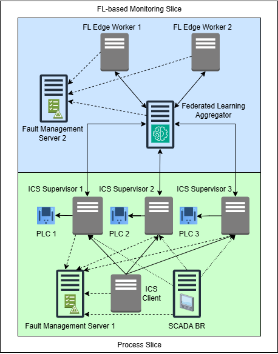

# NS-FLOTE
Network Slicing for Federated Learning in Operational Technology Environment

# Resilient Federated Learning and Network Slicing Framework for Industrial Control Systems  

This repository provides an innovative framework for enhancing the performance and security of Industrial Control Systems (ICS) and SCADA environments. Designed to address the challenges of Industry 4.0, the framework integrates **Federated Learning (FL)** with **network slicing** and **digital twin technology** to enable real-time anomaly detection and monitoring without disrupting operational processes.  

## Key Features  
- **Federated Learning**: Decentralized model training across distributed edge devices, ensuring data privacy and scalability.  
- **Network Slicing**: Virtualized segments for optimized performance, security, and reduced latency in OT environments.  
- **Digital Twin & NFV**: Real-time predictive analytics and monitoring using network function virtualization.  
- **Fault Tolerance**: Advanced mechanisms at container and instance levels to minimize downtime and disruptions.  

This resilient architecture supports the high-throughput, low-latency needs of modern ICS networks while maintaining robust cybersecurity. Performance evaluations demonstrate significant improvements in throughput, deployment efficiency, and learning accuracy.  

Contribute to the future of **industrial automation** and **data-driven decision-making** with this state-of-the-art solution!  

## FL-Integrated Network Slicing Architecture  

Incorporating network slicing dynamically into traditional ICS environments introduces significant improvements in security, efficiency, and adaptability. This approach divides a unified network into specialized slices tailored for specific data transfer needs, mitigating cybersecurity risks, ensuring data availability, and protecting critical industrial processes.  

This architecture extends its applicability to Industry 4.0, addressing heavy, distributed workloads such as edge-based Federated Learning (FL). Key features include fault tolerance, self-healing mechanisms, and advanced orchestration processes to support IoT-integrated and sensor-driven ICS networks. These mechanisms ensure continuity in operations while overcoming challenges with legacy communication protocols.  

### Key Components of the Architecture  

1. **Process Slice**  
   - **Purpose**: Manages industrial control processes with efficiency and security.  
   - **Components**:  
     - **SCADA BR**: Acts as the HMI, monitoring and overseeing data transfer within the ICS environment.  
     - **Fault Management Server 1**: Utilizes Docker API within a Docker Swarm stack to detect and resolve faults, ensuring minimal data loss.  
     - **ICS Supervisors (1, 2, 3)**: Manage data and commands between the ICS client and Programmable Logic Controllers (PLCs 1, 2, 3).  
     - **PLCs**: Execute real-time operational commands to control physical processes.  
     - **ICS Client**: Houses the ICS dataset, partitions Modbus packet data, and routes commands to ICS Supervisors for seamless process control.  

2. **FL-Based Monitoring Slice**  
   - **Purpose**: Focuses on data monitoring, anomaly detection, and model training using Federated Learning.  
   - **Components**:  
     - **FL Aggregator**: Central hub for aggregating data fragments from edge workers, monitoring abnormalities, and optimizing model training.  
     - **FL Edge Workers (1, 2)**: Collaborate to train models on segmented data, enhancing monitoring capabilities.  
     - **Fault Management Server 2**: Manages and redeploys containerized services, ensuring fault tolerance and self-healing for the FL infrastructure.  

### Advantages of the Architecture  
- Independent operation of slices minimizes single points of failure.  
- Enhanced scalability and fault tolerance.  
- Robust security for ICS environments with next-generation monitoring and orchestration.  

### Diagram  
The diagram below illustrates the architecture, showing the interaction between the **Process Slice** and the **FL-Based Monitoring Slice**.  

